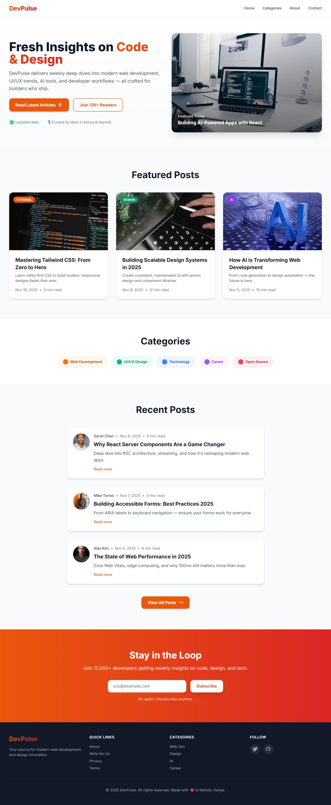

# DevPulse – Tech & Design Blog

A modern, responsive blog landing page built with **Tailwind CSS**. Clean, fast, and developer-friendly.



---

## Features

- **Fully responsive** – Mobile-first design
- **Real blog UX** – Featured posts, categories, recent articles
- **Creative intro section** – No hero, just smart content focus
- **Reliable images** – Direct Unsplash URLs with fallbacks
- **Newsletter form** – Styled, accessible, and functional
- **Mobile navigation** – Smooth toggle with JavaScript
- **Micro-interactions** – Hover effects, lifts, gradients
- **Kenya-optimized** – Localized touches (e.g., "Made in Nairobi")

---

## Technologies Used

- **HTML5**
- **Tailwind CSS** (via CDN)
- **Vanilla JavaScript** (mobile menu)
- **Google Fonts** – Inter
- **Unsplash** – Free, high-quality images

---

## Project Structure

```
.
├── index.html          # Main landing page
├── README.md           # This file
└── (No build tools – zero dependencies)
```

---

## How to Use

1. Copy `index.html`
2. Open in any browser
3. Deploy instantly (Netlify, Vercel, GitHub Pages)

> No build step. No npm. No config.

---

## License

This project is licensed under the **MIT License**:

```
MIT License

Copyright (c) 2025 DevPulse

Permission is hereby granted, free of charge, to any person obtaining a copy
of this software and associated documentation files (the "Software"), to deal
in the Software without restriction, including without limitation the rights
to use, copy, modify, merge, publish, distribute, sublicense, and/or sell
copies of the Software, and to permit persons to whom the Software is
furnished to do so, subject to the following conditions:

The above copyright notice and this permission notice shall be included in all
copies or substantial portions of the Software.

THE SOFTWARE IS PROVIDED "AS IS", WITHOUT WARRANTY OF ANY KIND, EXPRESS OR
IMPLIED, INCLUDING BUT NOT LIMITED TO THE WARRANTIES OF MERCHANTABILITY,
FITNESS FOR A PARTICULAR PURPOSE AND NONINFRINGEMENT. IN NO EVENT SHALL THE
AUTHORS OR COPYRIGHT HOLDERS BE LIABLE FOR ANY CLAIM, DAMAGES OR OTHER
LIABILITY, WHETHER IN AN ACTION OF CONTRACT, TORT OR OTHERWISE, ARISING FROM,
OUT OF OR IN CONNECTION WITH THE SOFTWARE OR THE USE OR OTHER DEALINGS IN THE
SOFTWARE.
