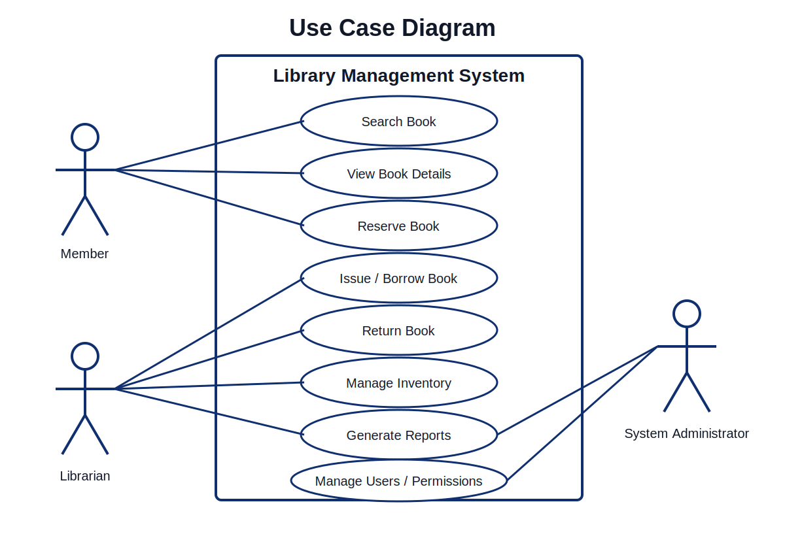
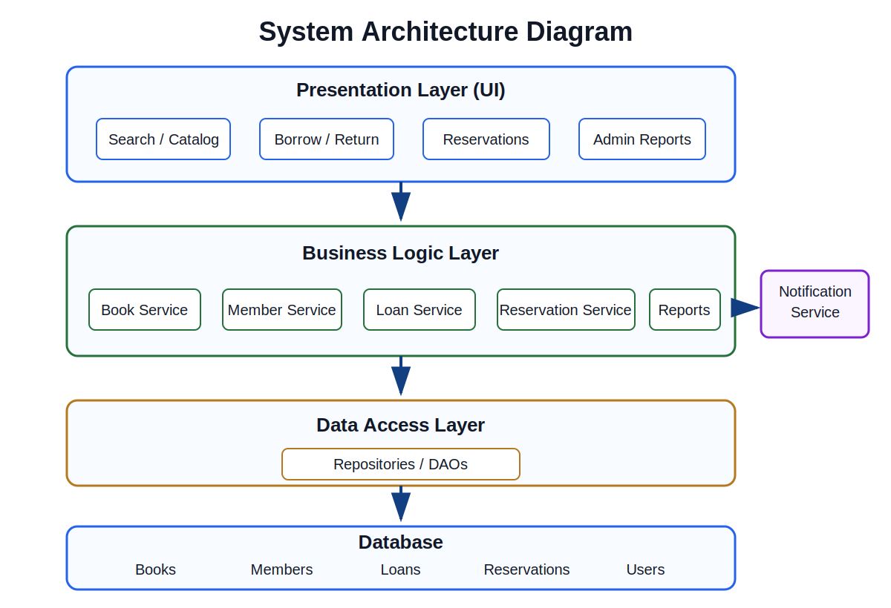
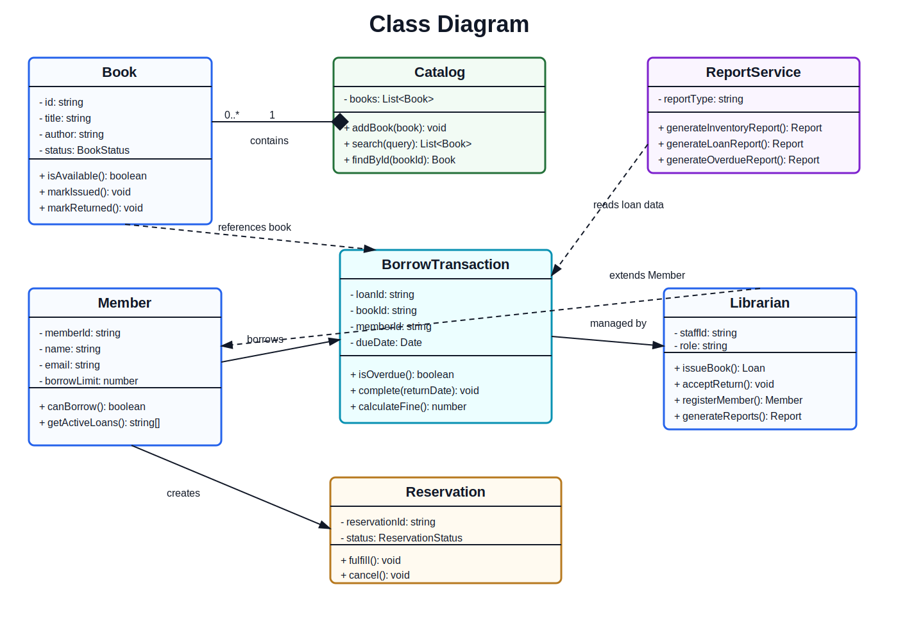
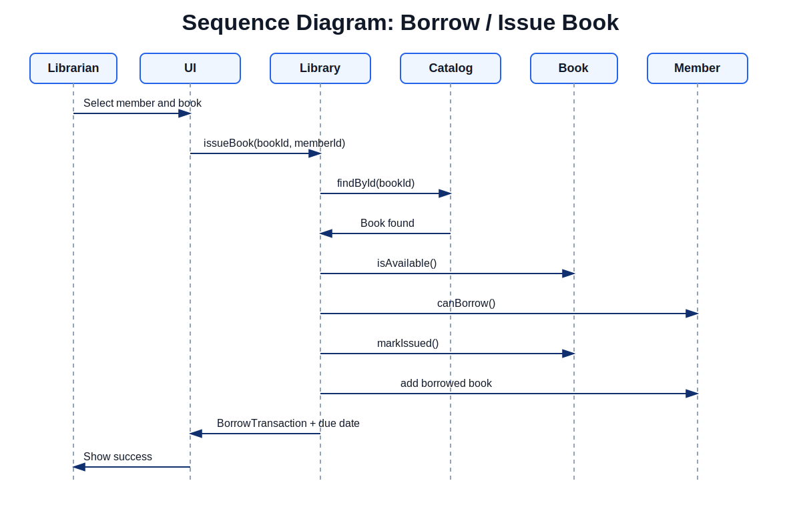
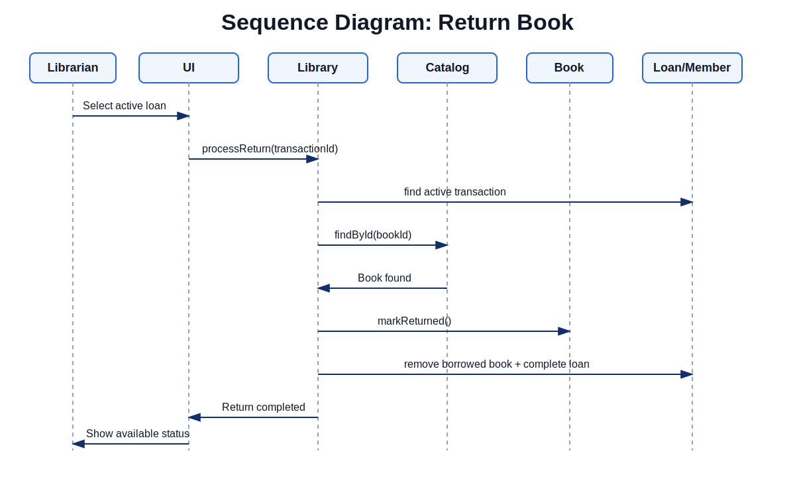
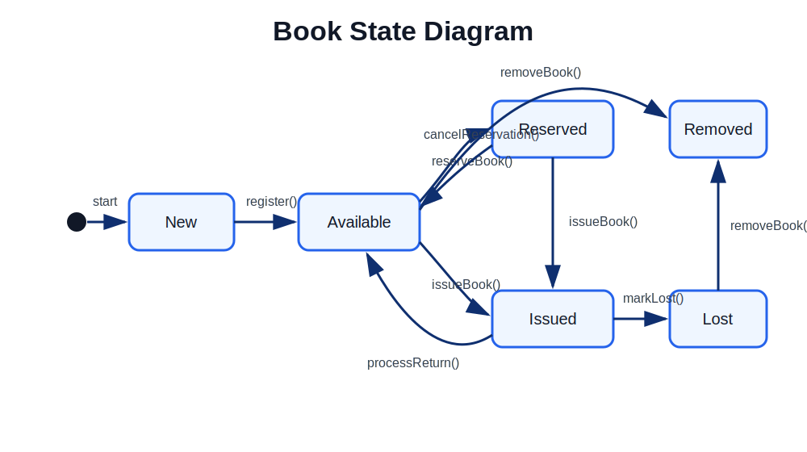
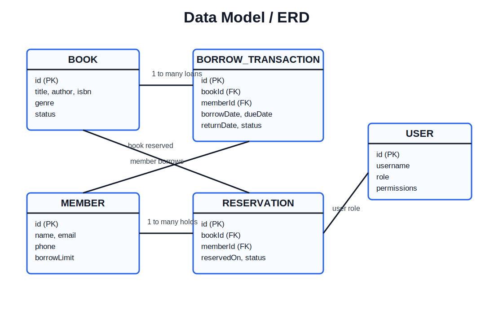

# Library Management System - OOA & Architecture Checkpoint

## Overview

This checkpoint models a simplified Library Management System before implementation. The system supports book search, member registration, borrowing, returning, reservations, inventory management, reports, overdue notifications, and user/permission administration.

## Assignment Structure

| Section | File |
|---------|------|
| Code Snippets | [snippets](snippets) |
| Diagram Images | [diagrams](diagrams) |

## Actors

| Actor | Responsibility |
|-------|----------------|
| Member | Searches books, views details, and reserves books. |
| Librarian | Registers members, issues books, processes returns, manages inventory, checks overdue loans, and generates reports. |
| System Administrator | Manages system users, permissions, and administrative reports. |

## Key Use Cases

- Search Book
- View Book Details
- Reserve Book
- Issue / Borrow Book
- Return Book
- Register Member
- Manage Inventory
- View Active Loans
- Check Overdue Books
- Generate Reports
- Manage Users / Permissions

## 1. Use Case Diagram

This diagram shows how Member, Librarian, and System Administrator interact with the main LMS functions.

## 2. System Architecture Diagram

The system is separated into Presentation, Business Logic, Data Access, and Database layers. The Notification Service is kept separate so overdue alerts do not mix with core lending logic.

## 3. Class Diagram

The class model identifies the main objects, their attributes, methods, and relationships. It includes `Book`, `Catalog`, `Member`, `Librarian`, `BorrowTransaction`, `Reservation`, `ReportService`, and `NotificationService`.

## 4. Sequence Diagram: Borrow / Issue Book

This sequence shows the issue-book flow: the librarian selects a member and book, the system checks availability and borrow limit, creates a loan, updates the book status, and returns the due date.

## 5. Sequence Diagram: Return Book

This sequence shows the return-book flow: the librarian selects an active loan, the system finds the transaction, marks the book available, updates the member record, and closes the loan.

## 6. Book State Diagram

This state diagram models the lifecycle of a book from registration to availability, reservation, issue, return, lost status, or removal.

## 7. Data Model / ERD

The data model shows how Books, Members, Borrow Transactions, Reservations, and Users are related.

## Implementation Snippets

The TypeScript snippets show how the analysis can map to simple code:

- [book.ts](snippets/book.ts): `Book`, `BookStatus`, and `Catalog`
- [member.ts](snippets/member.ts): `Member` and `Librarian`
- [library.ts](snippets/library.ts): `BorrowTransaction`, `TransactionStatus`, and `Library`
- [reservation.ts](snippets/reservation.ts): `Reservation` and `ReservationStatus`
- [report-service.ts](snippets/report-service.ts): simple report generation

## Design Principles

- **Encapsulation:** State changes happen through methods such as `markIssued()`, `markReturned()`, and `complete()`.
- **Single Responsibility:** Catalog manages books, Library coordinates use cases, Reservation handles holds, and ReportService handles reports.
- **Inheritance:** Librarian extends Member to reuse shared user information while adding staff responsibilities.
- **Abstraction:** The architecture separates UI, business rules, data access, and storage.
