# MongoDB CRUD Checkpoint

## Objective

This checkpoint demonstrates MongoDB CRUD operations using a database named `contact` and a collection named `contactlist`.

The work includes creating a database, creating a collection, inserting contacts, reading records, filtering records, updating one record, deleting records, and displaying the final result.

## Project Structure

```txt
mongodb-crud-checkpoint/
├── README.md
└── screenshots/
    └── ordered screenshot files
```

## Requirements

- MongoDB running locally or an active MongoDB connection.
- MongoDB Shell (`mongosh`) or MongoDB Compass Playground.

## 1. Open MongoDB CLI

Open MongoDB Shell with:

```bash
mongosh
```

Screenshot:

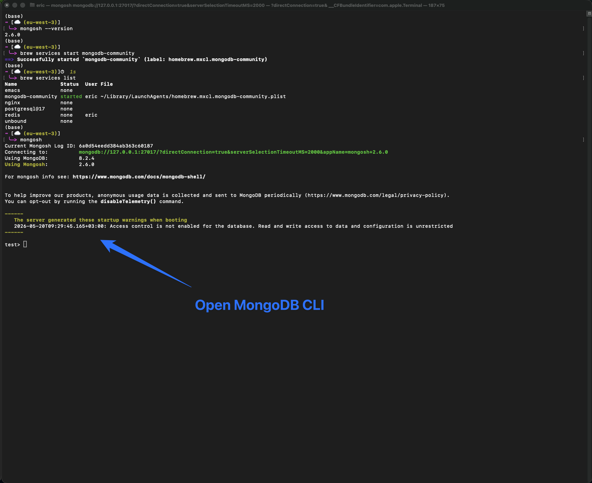

## 2. Create And Use The `contact` Database

```js
use contact
```

Screenshot:

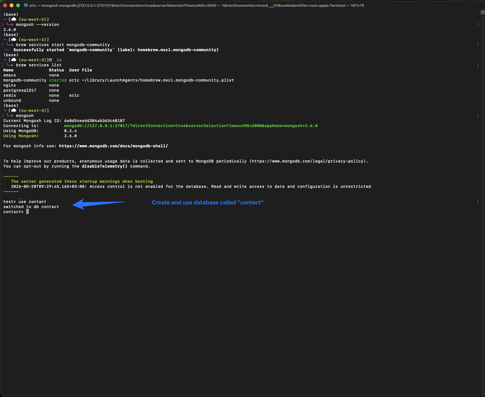

## 3. Create The `contactlist` Collection

```js
db.createCollection("contactlist")
```

Screenshot:

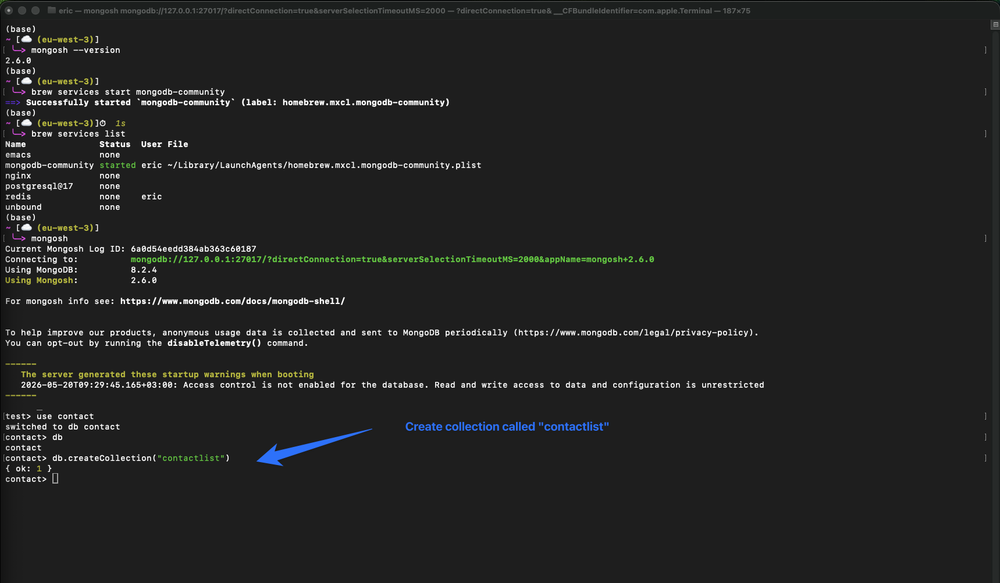

## 4. Insert Documents Into `contactlist`

```js
db.contactlist.insertMany([
  {
    lastName: "Ben",
    firstName: "Moris",
    email: "ben@gmail.com",
    age: 26
  },
  {
    lastName: "Kefi",
    firstName: "Seif",
    email: "kefi@gmail.com",
    age: 15
  },
  {
    lastName: "Emilie",
    firstName: "brouge",
    email: "emilie.b@gmail.com",
    age: 40
  },
  {
    lastName: "Alex",
    firstName: "brown",
    age: 4
  },
  {
    lastName: "Denzel",
    firstName: "Washington",
    age: 3
  }
])
```

Screenshot:

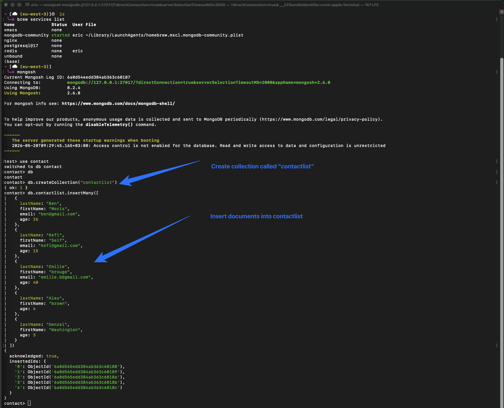

## 5. Display All Contacts

```js
db.contactlist.find().pretty()
```

Screenshot:

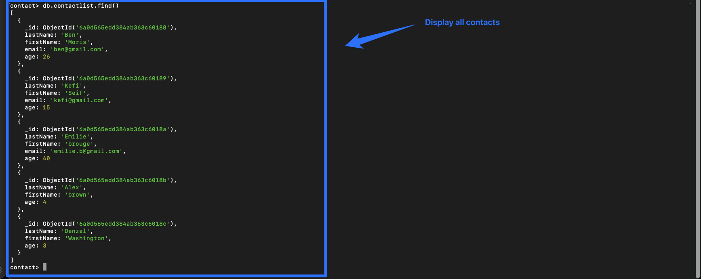

## 6. Display One Person Using ID

Copy an `_id` from the contacts list and use it with `ObjectId`.

```js
db.contactlist.findOne({
  _id: ObjectId("6a0d565edd384ab363c60189")
})
```

Screenshot:

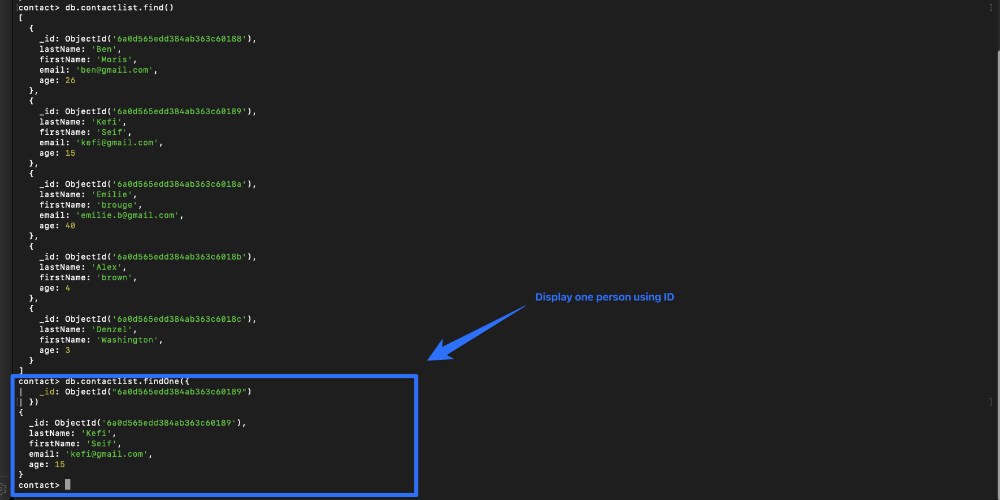

## 7. Display Contacts With Age Greater Than 18

```js
db.contactlist.find({
  age: { $gt: 18 }
}).pretty()
```

Screenshot:

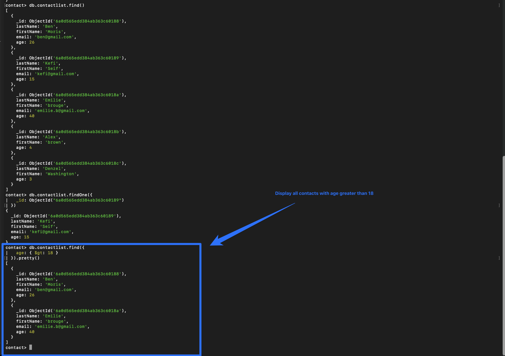

## 8. Display Contacts With Age Greater Than 18 And Name Containing `ah`

This checks both `firstName` and `lastName`.

```js
db.contactlist.find({
  age: { $gt: 18 },
  $or: [
    { firstName: { $regex: "ah", $options: "i" } },
    { lastName: { $regex: "ah", $options: "i" } }
  ]
}).pretty()
```

Screenshot:

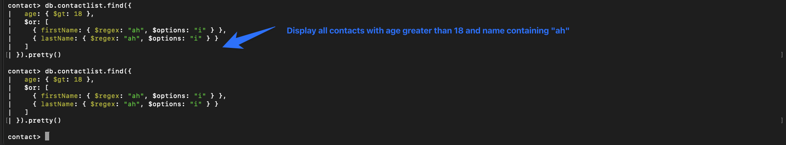

## 9. Change First Name From `Kefi Seif` To `Kefi Anis`

Since `Kefi` is the last name and `Seif` is the first name, update only the `firstName`.

```js
db.contactlist.updateOne(
  {
    lastName: "Kefi",
    firstName: "Seif"
  },
  {
    $set: { firstName: "Anis" }
  }
)
```

Confirm the update:

```js
db.contactlist.find({
  lastName: "Kefi"
}).pretty()
```

Screenshot:

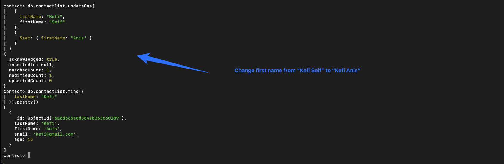

## 10. Delete Contacts Aged Under 5

```js
db.contactlist.deleteMany({
  age: { $lt: 5 }
})
```

This deletes:

- Alex brown, age 4
- Denzel Washington, age 3

Screenshot:

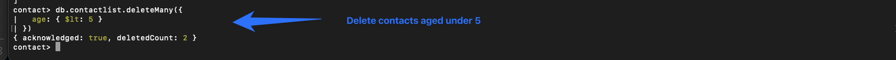

## 11. Display Final Contacts List

```js
db.contactlist.find().pretty()
```

Screenshot:

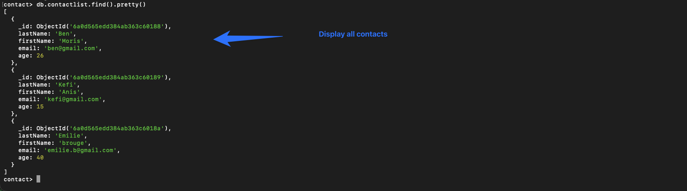

## Final Result

After all operations, the final contacts list contains:

| Last name | First name | Email | Age |
| --- | --- | --- | --- |
| Ben | Moris | ben@gmail.com | 26 |
| Kefi | Anis | kefi@gmail.com | 15 |
| Emilie | brouge | emilie.b@gmail.com | 40 |

## Screenshot Files

| File | Description |
| --- | --- |
| `screenshots/01-open-mongodb-cli.png` | Open MongoDB CLI |
| `screenshots/02-use-contact-database.png` | Create/use `contact` database |
| `screenshots/03-create-contactlist-collection.png` | Create `contactlist` collection |
| `screenshots/04-insert-documents.png` | Insert contacts |
| `screenshots/05-display-all-contacts.png` | Display all contacts before changes |
| `screenshots/06-display-one-contact-by-id.png` | Display one contact by ID |
| `screenshots/07-age-greater-than-18.png` | Display contacts with age greater than 18 |
| `screenshots/08-age-greater-than-18-name-ah.png` | Display contacts with age greater than 18 and name containing `ah` |
| `screenshots/09-update-kefi-anis.png` | Update Kefi Seif to Kefi Anis |
| `screenshots/10-delete-under-5.png` | Delete contacts aged under 5 |
| `screenshots/11-final-contact-list.png` | Display final contacts list |
