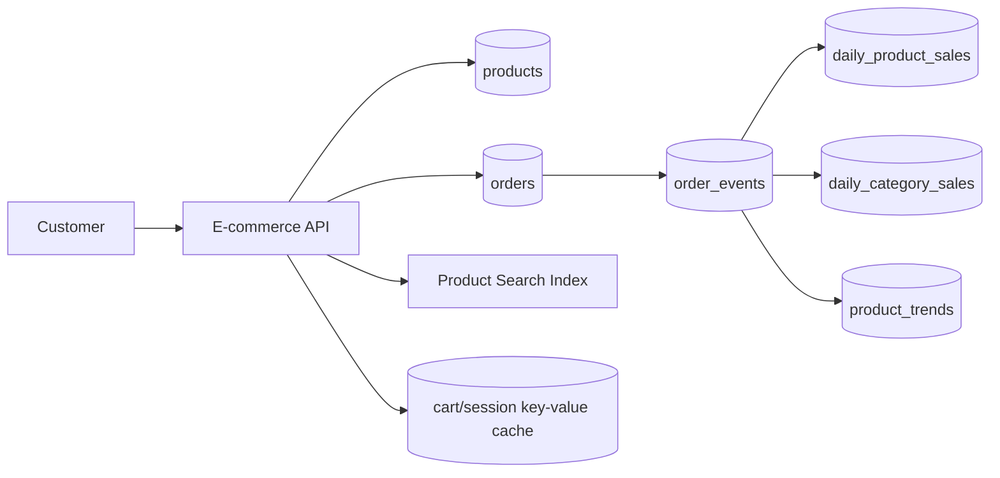

# Designing NoSQL Databases Based on Multiple Requirement Views

## Project Overview

This project is a practical NoSQL database design for an e-commerce application. It shows an initial MongoDB document design for products and orders, then refactors the design for analytics, high availability, partition tolerance, and scalability.

## Project Structure

```text
nosql-ecommerce-schema-design-checkpoint/
  docker-compose.yml
  package.json
  src/
    collections.js
    db.js
    seed.js
    createIndexes.js
    queries.js
    analyticsAggregation.js
  sample-data/
    users.json
    products.json
    orders.json
  schemas/
    initial-schema.md
    refactored-schema.md
  examples/
    sample-documents.json
  reports/
    reflection.md
```

## How to Run

Start MongoDB, install dependencies, and run the full demo:

```bash
docker compose up -d
npm install
npm run demo
```

`npm run demo` runs seed data, index creation, query examples, and analytics aggregation.

## Deliverables

| Requirement | File |
| --- | --- |
| Initial schema design | [schemas/initial-schema.md](./schemas/initial-schema.md) |
| Refactored schema design | [schemas/refactored-schema.md](./schemas/refactored-schema.md) |
| Reflection report | [reports/reflection.md](./reports/reflection.md) |
| Runnable implementation | [src](./src) |
| Sample data | [sample-data](./sample-data) |

## Requirement Checklist

- Identifies key entities: users, products, orders, order events, carts, and analytics summaries.
- Uses document-style collections for products, users, and orders.
- Uses embedded order item snapshots to avoid joins and preserve historical order data.
- Defines indexes for product search, product browsing, customer order history, delivery status, and analytics.
- Demonstrates full-text product search.
- Demonstrates customer order queries and delivery status updates.
- Demonstrates analytics refactor with pre-aggregated sales collections.
- Explains sharding, replication, denormalization, consistency, availability, and performance trade-offs.
- Includes a 200-300 word reflection report.

## Model Choices

| Requirement View | NoSQL Model | Example Technology | Reason |
| --- | --- | --- | --- |
| Product catalog | Document | MongoDB | Flexible product attributes and indexed browsing |
| Product search | Search / text index | MongoDB text index or Atlas Search | Fast keyword search |
| Orders | Document | MongoDB | Embedded customer and item snapshots |
| Carts and sessions | Key-value | Redis | Very fast temporary state |
| Analytics events | Wide-column | Cassandra-style model | High-volume append-heavy writes |
| Recommendations | Graph | Neo4j-style model | Product relationships and recommendations |

## Data Flow



## Collections and Queries

| Collection | Purpose | Main Query / Index |
| --- | --- |
| `users` | Customer profile and addresses | unique `email` |
| `products` | Product catalog and search fields | text search, category, status, price |
| `orders` | Order snapshots with customer, items, payment, delivery | customer history, delivery status |
| `order_events` | Append-only events for auditing and analytics | order id, event type |
| `customer_orders` | Denormalized customer order history | user id, created date |
| `daily_product_sales` | Pre-aggregated product sales | date, product id |
| `daily_category_sales` | Pre-aggregated category sales | date, category id |
| `product_trends` | Weekly product trend metrics | week, trend score |

## Refactor Summary

The initial design focuses on operational performance: product lookup, search, checkout, and order tracking. The refactored design separates analytics from transactional data by adding order events and pre-aggregated analytics collections. Sharding distributes high-volume product and order data, replication improves availability, and denormalization improves query performance for dashboards.
