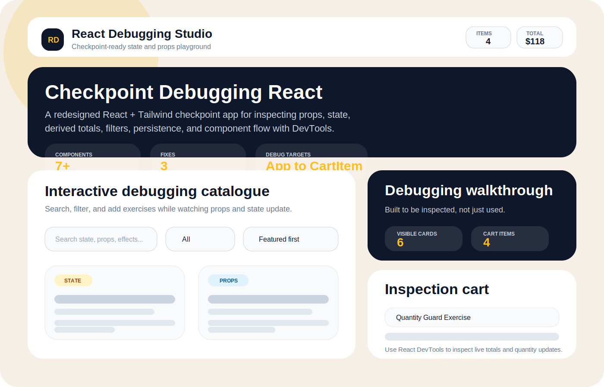
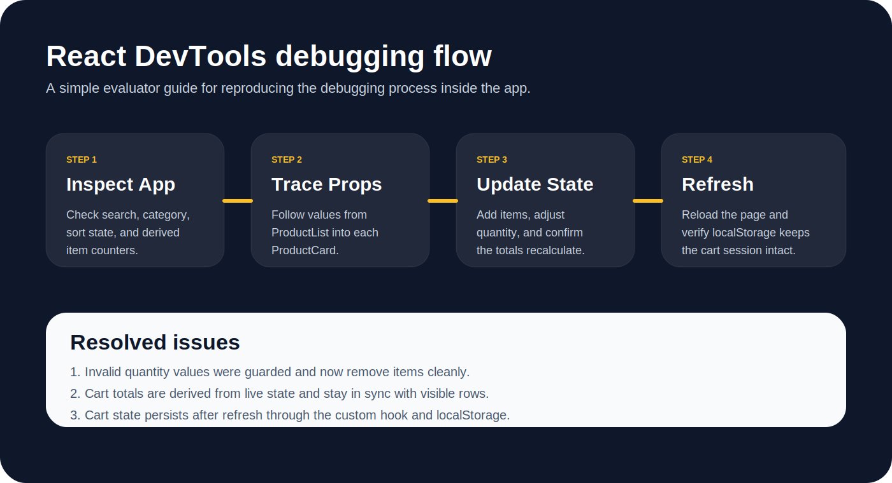
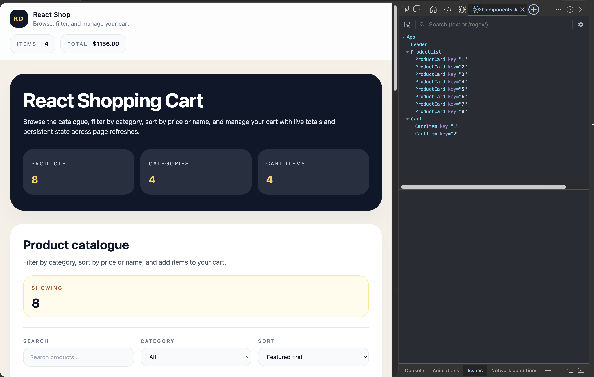

# React Shopping Cart — Debugging Checkpoint

A React + Tailwind CSS shopping cart application built for the Gomycode React debugging checkpoint. The app demonstrates component composition, shared state, props flow, derived values, and localStorage persistence — all designed to be inspected with React Developer Tools during the evaluation session.

## App Preview





## Features

- Browse a product catalogue with search, category filter, and sort controls
- Add items to the cart and adjust quantities in real time
- Derived cart totals that recalculate live from state (subtotal, tax, total)
- Cart state persisted to `localStorage` — survives a full page refresh
- Fully responsive layout built with Tailwind CSS

## Component Tree

```
App
├── Header          — sticky nav with live item count and total
├── ProductList     — filter controls and product grid
│   └── ProductCard — individual product card with add-to-cart
└── Cart            — sidebar cart with quantity controls and totals
    └── CartItem    — single row with increment / decrement / remove
```

State lives in `App` (search, category, sort) and in the `useCart` custom hook (cart items, localStorage sync).

## Files That Matter Most

| File | What to inspect |
|------|-----------------|
| `src/App.tsx` | Top-level state: search term, selected category, sort order, derived filtered list |
| `src/hooks/useCart.ts` | Cart state, add / remove / update logic, localStorage effect |
| `src/components/ProductList/ProductList.tsx` | Filter props flowing down from App |
| `src/components/ProductCard/ProductCard.tsx` | Product object props and the add-to-cart callback |
| `src/components/Cart/Cart.tsx` | Derived subtotal, tax, and total from cart state |
| `src/components/CartItem/CartItem.tsx` | Quantity update and remove callbacks |

## How To Run

```bash
npm install
npm run dev
```

Open the local Vite dev URL in your browser. The app starts on port 5173 by default.

---

## Checkpoint — Debugging Walkthrough

This section covers the debugging process required by the checkpoint assignment.

### Checkpoint goal

The assignment asks for a React application with:

- Multiple components
- State management
- Props passing between components
- Debugging with React Developer Tools
- A documented record of issues found and fixes applied

### 1. Inspect the component tree

Open React Developer Tools and verify the component hierarchy:

```
App → Header → ProductList → ProductCard → Cart → CartItem
```

Confirm in the DevTools component panel:

- `App` holds `searchTerm`, `selectedCategory`, `sortBy`, and `cartItems` (via `useCart`)
- `filteredProducts` is derived from `products` + the three filter state values
- Props flow from `App` into `ProductList` and from there into each `ProductCard`
- Cart props (`cartItems`, `subtotal`, `total`) flow from `App` into `Cart` and then into each `CartItem`

### 2. Reproduce interactive state changes

Use the UI to trigger visible updates in React DevTools:

1. Type in the search box — watch `searchTerm` update in `App`
2. Change the category dropdown — watch `selectedCategory` update and the filtered list shrink
3. Change the sort — watch `filteredProducts` reorder without touching source data
4. Click **Add to cart** on any product — watch `cartItems` array grow in `useCart`
5. Click `+` / `−` on a cart row — watch the quantity and total update immediately
6. Refresh the page — confirm the cart reloads from `localStorage`

### 3. Issues fixed

These are the bugs that were identified and corrected during the checkpoint:

**Quantity edge cases**
The cart now removes a row when quantity drops below `1` instead of leaving a zero or negative quantity behind. The fix is in `useCart.ts → updateQuantity`.

**Derived totals**
Cart totals are recalculated from live state on every render so the displayed amount always matches the visible rows and quantities. Previously, a stale total could persist after removing an item.

**State persistence**
The `useCart` hook now syncs cart updates to `localStorage` via a `useEffect` that runs whenever `cartItems` changes. A page refresh restores the full cart instead of resetting to empty.

### 4. React DevTools inspection steps



Open the **Components** panel and follow these steps:

1. **Select `App`** — confirm `searchTerm`, `selectedCategory`, `sortBy` are all visible in state, and `cartItems` is visible via the `useCart` hook
2. **Select `ProductList`** — verify it receives `products` (filtered array), `searchTerm`, `selectedCategory`, `sortBy`, and `categories` as props
3. **Select any `ProductCard`** — verify the `product` prop contains the full object: `id`, `name`, `price`, `image`, `category`, `description`, `badge`, `stock`, `featured`
4. **Select `Cart`** — verify `cartItems`, `subtotal`, and `total` props match the values shown in the UI
5. **Select a `CartItem`** — verify the `cartItem` prop shows the correct product and quantity, and click `+` or `−` to watch it update live

## Validation

```bash
npm run build   # tsc type-check + Vite production build
npm run lint    # ESLint
```
